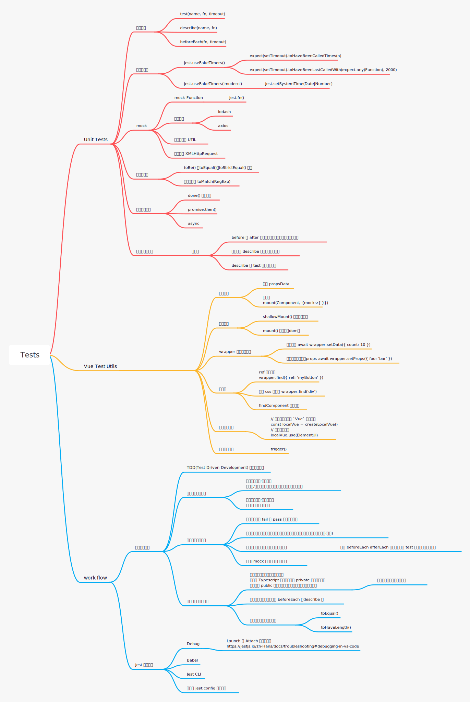

# 基本介绍
## 钩子函数
* [作用域及不同作用域下的钩子执行顺序](https://jestjs.io/zh-Hans/docs/setup-teardown)
* describe 和 test 块的执行顺序。先将 describe 层的代码执行完，然后执行 test
* 可以使用 test.only('',()=>{}) 仅执行一条测试用例

## [全局设定](https://jestjs.io/zh-Hans/docs/api)
jest 包含一些全局设定的对象和函数，可以直接使用它们。
* test()
* describe()
* beforeEach()
## 匹配器
* toBe() toEqual() toStrictEqual()

```js
test.only('object equal',()=>{
  let obj1 = {
    name:'jack',
    age:12,
    friends:['rose']
  }
  let obj2 = {
    name:'jack',
    age:12,
    friends:['rose'],
    address:undefined
  }
  let obj3 = obj1
  expect(obj1).toEqual(obj2) // key-value 键值对比较
  expect(obj1).toStrictEqual(obj2) // keys 比较，以及值比较 hasOwnProperty()
  expect(obj1).toBe(obj3)  // 引用比较 Object.is(obj1,obj2)
})
```
## 计时器模拟
### jest.useFakeTimers('legacy')
* 使用 `toHaveBeenLastCalledWith` 判断最后一次调用 setTimeout() 函数的入参数
```js
test('call',()=>{
  let fn = jest.fn(()=>{})
  fn('foo')
  //fn('foo1')
  expect(fn).toHaveBeenLastCalledWith('foo') // 最后调用 fn 传入的参数是 foo
}) 
```

```js
jest.useFakeTimers(); // fake timers
// 最后一次调用 timer 传入的参数是
expect(setTimeout).toHaveBeenLastCalledWith(expect.any(Function), 1000);
```

* expect.any(constructor)
作为构造函数的实例，可以匹配任意该构造函数的实例。
```js
test('call',()=>{
  let a = 1
  expect(a).toEqual(expect.any(Number)) // true
}) 

test('call',()=>{
  let fn = jest.fn(()=>{})
  fn(1)
  expect(fn).toBeCalledWith(expect.any(Number))
}) 
```
* 如何判断函数是否被执行，而不使用 `expect.any(Function)`
```js
const handle = timerGame(fn);
expect(setTimeout).toHaveBeenLastCalledWith(handle, 1000);
```
* `jest.advanceTimersByTime(1000)` 时间快进

```js
// 这两者的区别，一个是判断传递个 setTimeout 的参数
expect(setTimeout).toHaveBeenLastCalledWith(expect.any(Function), 1000);
// 这个是判断我们传递的回调函数是否执行
expect(callback).toBeCalled();
```
### jest.useFakeTimers('modern')
`jest.useFakeTimers('modern')` 和 `jest.setSystemTime(number|Date)` 配套使用,用来模拟 date

## mock
### mock 函数
为什么要使用 mock 函数？
* 捕获函数的调用情况 `toHaveBeenCalled` 必须使用 mock 函数
* 设置函数返回值 
* 改变函数的内部实现
```js
describe('mock function',()=>{
  test.only('mock.fn',()=>{
    let mockFn = jest.fn((arg)=>arg + ' is passed')
    let result = curry(mockFn)('foo')
    expect(mockFn).toBeCalled()
    expect(mockFn).toHaveBeenCalled();
    expect(mockFn).toHaveBeenCalledTimes(1);
    expect(mockFn).toHaveBeenCalledWith("foo");
    expect(result).toBe('foo is passed')
  })
})
```

### mock 模块
查看 `wxb-manager/utils.test.js` 测试 commonUploadPictureOrFile 方法，依赖了很多其他配置，而我们关心它的依赖配置，只考虑函数的输入会导致不同的输出。  

创建 \_\_mocks\_\_ 文件夹，放置手动模拟的模块。搜索优先级会比 node_modules 高

```js
// __mocks__/axios
const get = url => {
  return Promise.resolve({ data: { title: 'delectus aut autem' } });
};
const post = url=>{
  if(url === 'https://wxb-manger/userinfo'){
    return Promise.resolve({
      data:{
        userInfo:{
          isAdmin:true,
          expired:false
        }
      }
    })
  }
}
exports.get = get;
exports.post = post
```
```js
// __mocks__/lodash
module.exports = {
  chunk(arr,len) {
    let length = arr.length 
    let i = 0
    let store = []
    while(i<length){
      store.push(arr.slice(i,i+len))
      i+=len
    }
    return store
  }
}
```

## 异步代码测试
```js
  test("callback was't called",()=>{
    const callback = data=>{
      expect(data).toBe('suc') // 断言不会被执行
    }
    asyncHandle(callback)
  })
```
1. 使用 test 提供的回调函数 done()
```js
  test('callback called',(done)=>{
    const callback = data=>{
      expect(data).toBe('suc')
      done()
    }
    asyncHandle(callback)
  })
```
2. 在 promise.then() 执行断言
```js
  test('called in promise.then',()=>{
    asyncHandle().then(res=>{
      expect(res).toBe('suc')
    })
  })
```
3. 使用 async 函数
```js
  test('async',async ()=>{
    let res = await asyncHandle()
    expect(res).toBe('suc')
  })
```
# 工程化

## babel 配置
使用 babel 可以使用更多高级功能    
如果在已有项目中，需要兼容之前的 babel 的配置，`jest will set process.env.NODE_ENV to 'test'`可以通过判断环境来兼容 jest 所需的 babel 配置和项目的 babel 配置。 
```js
// babel.config.js
module.exports = api => {
  const isTest = api.env('test');
  const jestConfig = { /* ... */}
  const projectConfig = { /* ... */}
  return isTest ? jestConfig : projectConfig 
};
```
## jest 配置文件
1. `jest --init`
2. Config jest
```js
module.exports = {
  moduleFileExtensions: [
    "js",
    "ts",
    "json",
    "vue"
  ],
  // 使用新功能
  transform:  {
    "\\.ts$": ['ts-jest'], 
    "\\.js$": ['babel-jest', {rootMode: "upward"}],
    // 用 `vue-jest` 处理 `*.vue` 文件
    ".*\\.(vue)$": "vue-jest",
    "^.+\\.tsx?$": "ts-jest"
  },
  transformIgnorePatterns: [ //忽略该路径下的文件转译
    "/node_modules/",
    "\\.pnp\\.[^\\/]+$"
  ],
  testPathIgnorePatterns: [ // 忽略该路径下的测试文件
    "/node_modules/"
  ],
  clearMocks: true, // 每个测试直接清除 mock
  moduleNameMapper:{ // map 映射
    "^@/(.*)$":"<rootDir>/src/$1",
    "^assets/(.*)$": [
      "<rootDir>/images/$1",
      "<rootDir>/photos/$1",
      "<rootDir>/recipes/$1"
    ]
  }
}
```
## jest CLI
* `jest --watch` 监听文件改动
* `jest -o async.test.js example.test.js` 仅运行指定模版

## Debug
Launch 和 Attach 模式的配置

[vscode debug 配置](https://jestjs.io/zh-Hans/docs/troubleshooting#debugging-in-vs-code)

# 更好的 Tests
* TDD(Test Driven Development) 测试驱动开发,在开发前根据 qa 列好的测试用例来定义我们要测试的点(需求文档梳理的过程)。
* 注意测试粒度的设计。
  * 对于常改动的模块，我们可以根据功能点去写测试，这样功能不变的情况无需关系内部实现。
  * 功能还是和类可以测试细节功能点。
* 保障测试的可靠性
  * 不依赖外界条件，保证一个输入对应一个输出。
  * 包含 fail 和 success。
  * 测试之间不互相依赖状态。
  * 避免去mock 方法、类的私有的方法和属性。
* 测试可维护性
  * 将重复代码提取到前置的构造函数
  * 多使用匹配器提高可阅读性
  * 保持测试的逻辑简单，适当的粒度。避免代码改动修改修改过多的测试用例